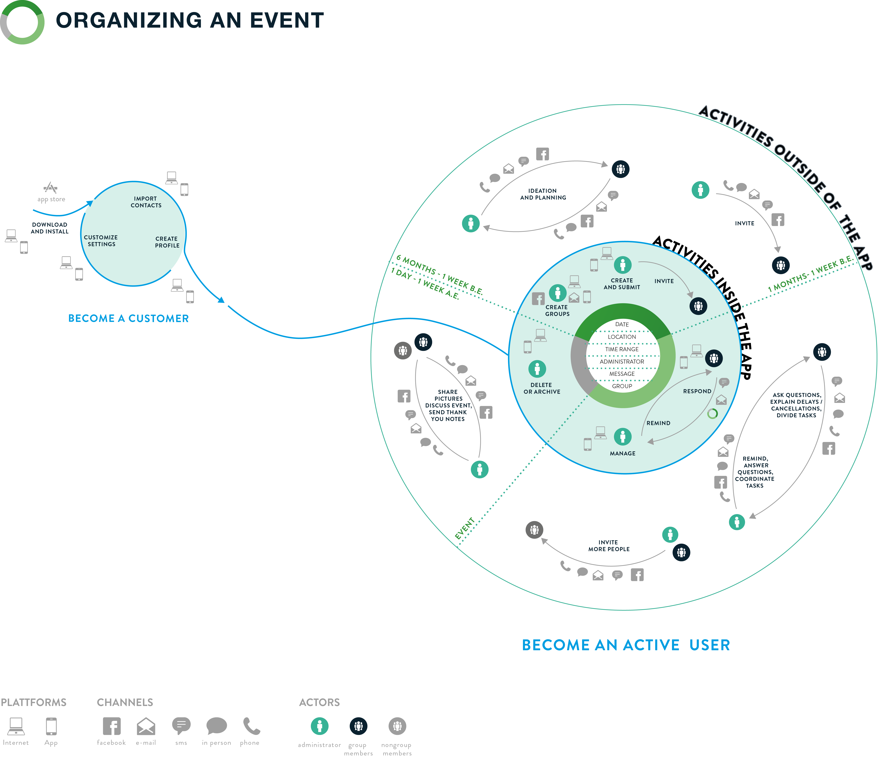

# Digital_Ecosystems 

## Intro

A map that visualizes the company’s digital ecosystem in a way that clearly illustrates their digital properties, the connections between them, and their purpose in the overall marketing strategy.

An ecosystem map gives you insight around the role of each piece of the system, as well as on opportunities to leverage existing assets to achieve the brand’s business goals.

> “The battle of devices has now become a war of ecosystems, where ecosystems include not only the hardware and software of the device, but developers, applications, ecommerce, advertising, search… location-based services, unified communications and many other things. Our competitors aren’t taking our market-share with devices; they are taking our market share with an entire ecosystem. This means we’re going to have to decide how we either build, catalyse or join an ecosystem.” - Stephen Elop, CEO Nokia

## Definition

The concept of an ecosystem can be given to a set of products, services, and people that function together in a symbiotic way. 

Clients often want to include all functionality because they believe it will  increase their value, the more important feature is choosing *which* products to integrate with.

The word ecosystem comes from biology wherein it describes a network of interacting organisms and their physical environment. From a technical standpoint, an ecosystem is better described as a network of people interacting with products or serves.

The ecosystem includes:
* Users
* practices they perform
* information they use and share
* people with whom they interact
* services available to them
* devices they use
* channels through which they communicate

Answers to these questions provide designers with all of the raw data they need in order to better understand the ecosystem in which they’re working. Turning that data into actionable information is the job of the ecosystem maps.

## Ecosystem Map

A graphical representation of the relationships examined via ecosystem thinking. They are similar to service blueprints, experience maps, and concept maps but differ in the fact that these maps are optimized to aid in the creation of digital strategies.

Mapping out an ecosystem illustrates five major activities:

1. Understanding users and their goals
2. Mapping the activities as to the users conduct in the service of their goals
3. Mapping the information, services, devices, and channels that users employ in service of their activities.
4. Mapping the moments in which users perform their activities
5. Narrowing down the discrete set of moments (experiences) upon which the design team might focus.

It is not meant to illustrate an actual map, No map can really encompass the full complexity of an entire ecosystem; an illustration will always be a simplification of reality. 

Creating a map starts with research. Interviews, observations, questionaries, and analysis of web site statistics. This helps us determine the goals toward which users are working toward and how to accomplish their goals.

First, define who the actors are. These include the people and the devices involved in a process. Spatially organize these actors to reflect the flow and process of interactions.

After arranging the actors, illustrate all of the activities undertaken by users as well as the information. services, devices, and channels they use for doing these activities. Cycle through the questions comprising the ecosystem thinking.

* When do users perform activities?
* Who do people connect with?
* What items are in the middle of these interactions?

Do not worry about specifics in the beginning, It is more important to have a “best guess” and put something down. When more information becomes available down the line, organization will likely emerge and present itself.

The final step is to determine the activities that our team will support through design. Not everything that is part of an ecosystem should be integrated into a digital product or service: it’s all about making strategic, informed choices. This helps us to distinguish *what is necessary* from what *is nice to have*

## Sources

https://gibbon.co/uxdesign

