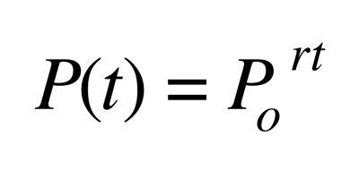

# Exponential Growth in Populations

Thomas Malthus exponential law of population Growth

"At its most elementary level, interspecific competition involves two species utilizing a similar resource. It rapidly gets more complicated, but stripping the phenomenon of all its complications, this is the basic principle: two consumers consuming the same resource."

It is an approximate physical law that it is generally acknowledged that nothing can grow at a constant rate indefinitely.
Accurate for short term predictions but not suitable for predictions 10 to 20 years from now.
Compared to and has "certain limited resemblance" to the laws of Newtonian mechanics.

###Rule of 70
Roughly explains the time periods involved in exponential growth at a constant rate.

##### EXAMPLE
If growth is measured annually then a 1% growth rate results in a doubling every 70 years.
The number 70 comes from the observation that the natural log of 2 is about 0.7

## Common Terms

Species Population
All individuals of a species

#### Metapopulation
A set of spatially disjunct population, among which there is some immigration

#### Population
A group of conspecific individuals that is demographically, genetically, or spatially disjunct from other groups of individuals

#### Aggregation
A spatially clustered group of individuals

#### Deme
A group of individuals more genetically similar to each other than to other individuals, usually with some degree of spatial isolation as well.

#### Local Population
A group of individuals within an investigator-delimited area smaller than the geographic range of the species and often within a population (as defined above) A local population could be a disjoint population as well.

#### Subpopulation
An arbitrary spatially delimited subset of individuals from within a population.
