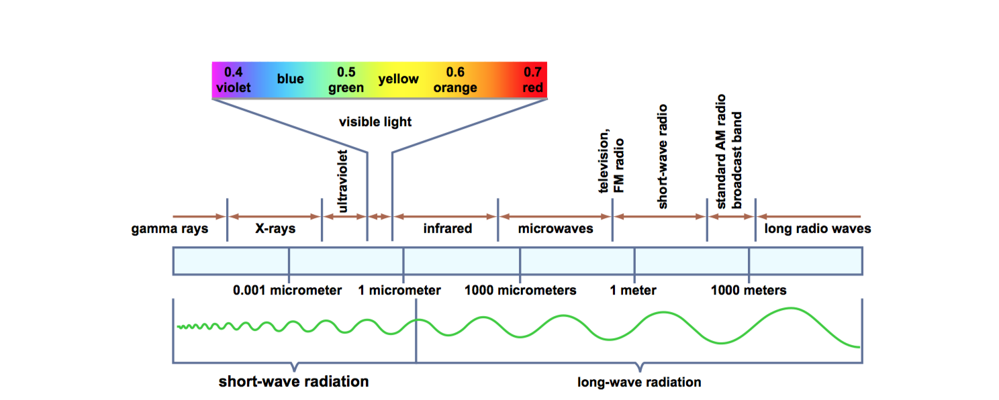

# Earth Surface

## Energy

First we must be comfortable with the three forms of energy.

* kinetic energy - energy of motion, speed
* potential energy - energy of position
* thermal energy - thermal motion of atoms of molecules

Kinetic energy and potential energy together often are referred to as **mechanical energy**.  

Throwing a ball in the air puts an object in motion (kinetic energy). When it reaches the top the kinetic energy is converted into potential energy. Together, this **mechanical energy** is said to be conserved.

On earth with the presence of air, the friction between the air and the ball convert the mechanical energy to thermal energy. 

## Electromagnetic Radiation

All bodies (pieces or regions of matter, in the physicists parlance) at temperature above absolute zero radiate energy in the form of **electromagnetic waves**.

#### Wien’s Law
The product of the absolute temperature and the wavelength of the most intense radiation is a constant. 

This means that a body with a relatively high surface temperature, like the sun, radiates energy at relatively short wavelengths, and a body like a relatively low surface temperature, like the earth, radiates energy at relatively long wavelengths.

